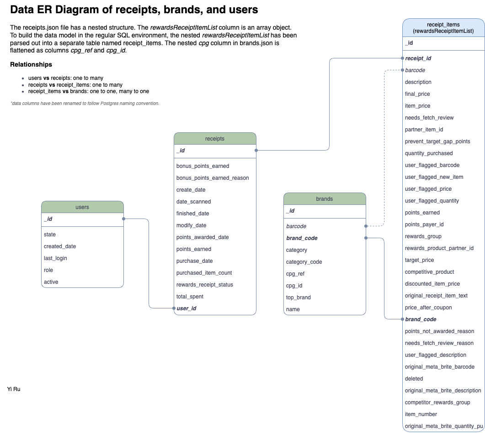

# Fetch Rewards Coding Exercise

Yi Ru

Feb 28, 2025

---

### Part 1

I opened the JSON files and quickly examined the files - the original JSON files are seemingly in MongoDB JSON export format - it has a `"$oid"` structure in the id field, and all the objects are not constructed in an array (missing opening and ending `[]` as well as missing comma between objects). 

I reformatted the file to standard JSON format (an array of objects), then I noticed that the `receipts.json` file has a nested structure in the column `rewardsReceiptItemList`. Therefore, I created a Python script to flatten out the nested structure and upload the data to my local Postgres database for data modeling, located in `scripts/upload_json.py`. All SQL queries in this exercise are in **Postgres** style.

The relational data model ER diagram is shown below:


---

### Part 2
For this part, I answered all the questions for my own practise. I set up a dbt_core & Postgres environment in my local and run my testing queries on Postgresql via DBeaver.

#### 1. What are the top 5 brands by receipts scanned for most recent month?
The model is at [models/marts/fct_fetch__most_freq_brands_last_month.sql](models/marts/fct_fetch__most_freq_brands_last_month.sql). The modeling logic is to append the brand name to the receipt_items first, then filter the items where the receipt_id fall within the last_month range.
However, there might be a data quality issue in the `brand_code` column in the `reiceipt_items` table. Based on the query results, only one brand called `Viva` shows up. Others look like placeholders for testing purposes.

|brand|brand_code|count|
|-----|----------|-----|
|Viva|VIVA|1|
|[NULL]|[NULL]|0|
|[NULL]|MISSION|0|
|[NULL]|BRAND|0|


#### 2. How does the ranking of the top 5 brands by receipts scanned for the recent month compare to the ranking for the previous month?
The model is at [models/marts/fct_fetch__most_freq_brands_prev_month.sql](models/marts/fct_fetch__most_freq_brands_prev_month.sql). The modeling logic is the same as the last_month model, but only changed the time interval. The top 5 brands are in the list below:

| brand | brand_code | count |
| ----- | ---------- | ----- |
|Pepsi|PEPSI|93|
|Kleenex|KLEENEX|88|
|KNORR|KNORR|79|
|Doritos|DORITOS|77|
|Kraft|KRAFT|60|

The results from the previous question don't make too much sense. Therefore, the comparison of them two is pointless.


#### 3. When considering average spend from receipts with 'rewardsReceiptStatus’ of ‘Accepted’ or ‘Rejected’, which is greater?
We just need to get the average of `total_spent` out of `receipts` table, then group by the `rewardsReceiptStatus`. The `AVG()` function will automatically calulate the average of each group. The results of this question can be easily pull out by this query:
```sql
select
	rewards_receipt_status,
	round(avg(total_spent)::numeric, 2) as average_spent
from
	receipts as r
where
    rewards_receipt_status in ('REJECTED', 'FINISHED')
group by
	rewards_receipt_status;
```
The output will be:
|rewards_receipt_status|average_spent|
|----------------------|-------------|
|REJECTED|23.33|
|FINISHED|80.85|

The average spend of **Finished (Accepted) is greater** than Rejected. Model located at: [models/marts/fct_fetch__avg_spend_rrs.sql](models/marts/fct_fetch__avg_spend_rrs.sql)


#### 4. When considering total number of items purchased from receipts with 'rewardsReceiptStatus’ of ‘Accepted’ or ‘Rejected’, which is greater?
Same idea as the previous question, just need to calculate the sum of `purchased_item_count`:
```sql
select
	rewards_receipt_status,
	sum(purchased_item_count) as items_purchased
from
	receipts as r
where
    rewards_receipt_status in ('REJECTED', 'FINISHED')
group by
	rewards_receipt_status;
```
The output is:
|rewards_receipt_status|items_purchased|
|----------------------|---|
|REJECTED|173.0|
|FINISHED|8184.0|

The average spend of **Finished (Accepted) is greater** than Rejected. Model located at: [models/marts/fct_fetch__item_purchased_rrs.sql](models/marts/fct_fetch__item_purchased_rrs.sql)


#### 5. Which brand has the most spend among users who were created within the past 6 months?
For this question, we just need to filter the receipts through the users criteria, then sum up the spent by brands. The final model is at: [models/marts/fct_fetch__most_spend_brands.sql](models/marts/fct_fetch__most_spend_brands.sql). I ordered by the sum decending and limit 5, for better viewing purpose. The output is:
|brand|spent_sum|
|-----|---------|
|Cracker Barrel Cheese|703.50|
|KNORR|543.32|
|Kleenex|356.07|
|Doritos|323.64|
|Pepsi|250.39|

Therefore, the **Cracker Barrel Cheese** has the most spend amonut at **703.50**, among users who were created within the past 6 months.


#### 6. Which brand has the most transactions among users who were created within the past 6 months?
If we are only consider how many times that the brand appears in the receipt_items, among users who were created within the past 6 months, the query should be:
```sql
select
	"name" as brand,
	count("name") as count
from
	stg_fetch__receipt_items_last_6_months
where
	"name" is not null 
group by
	"name"
order by
	count desc
limit 5;
```
Thus the top 1 is Pepsi has 74 counts.

However, if we see one receipt is one transaction (no matter how many the customer bought in one receipt), we need to add the `receipt_id` into the group by clause:
```sql
select
	"name" as brand,
	receipt_id,
	count("name") as transaction_count
from
	stg_fetch__receipt_items_last_6_months
where
	"name" is not null 
group by
	"name", receipt_id 
order by
	transaction_count desc
limit 5;
```
The model is located at: [models/marts/fct_fetch__most_transactions_brands.sql](models/marts/fct_fetch__most_transactions_brands.sql). The output is:
|brand|transaction_count|
|-----|-----------------|
|KNORR|17|
|Doritos|15|
|Kleenex|14|
|Pepsi|13|
|Doritos|12|

KNORR has appeared in 17 transactions among users who were created within the past 6 months.

---

### Part 3
When exploring and working with the provided dataset, I do noticed several data quality issue:

1. MongoDB-style JSON.
- The goal is to map the data to a structured relational data model. But the Mongo-style JSON will not be properly parsed by Python `json` package or `pandas.read_json` function.

2. Extremely long list of `rewardsReceiptItemList` for several objects. This could potentially cause slowlyness in data preprocessing.

3. Duplicate on `users` table.
- When exploring the raw data by simple select, I found out that the `users._id` is not unique. 
```sql
select * from users
order by _id;

-- group by and count the _id
select _id, count(*) from users
group by _id
order by count desc
```
I got something like this:
|_id|count|
|---|-----|
|5fc961c3b8cfca11a077dd33|20|
|54943462e4b07e684157a532|20|
|5ff5d15aeb7c7d12096d91a2|18|


4. In question 1, some reiceipt_items don't have brand_code, especially the transactions been made in the last month. There might be issues in the upstream services that collect these data.
```sql
with receipts_last_month as(
	select * from receipts
	where date_scanned >= (select max(date_scanned) from receipts) - '1 month'::interval
),
receipt_items_with_brands as (
	select ri.*, b."name" from receipt_items as ri
	left join brands as b 
	on ri.brand_code = b.brand_code
)
select "name" as brand, brand_code, count("name") as count
from receipt_items_with_brands as riwb
where riwb.receipt_id in (select _id from receipts_last_month)
and (deleted != true or deleted is null)
group by "name", brand_code
order by count desc
limit 5
```
5. In the `brands` table, some `barcode` has duplicates, and their corresponding `brand_code` differs. By common sense, the barcode should be unique to the item. They shouldn't have the same barcode pointing to two different products.
```sql
select barcode, count(barcode) from brands as b 
group by barcode 
having count(barcode) > 1
```
Then I checked some examples:
```sql
select barcode, brand_code, "name"  from brands as b 
select barcode, brand_code, "name"  from brands as b 
where barcode in 
('511111204923','511111004790')
order by barcode
```
|barcode|brand_code|name|
|-------|----------|----|
|511111004790|BITTEN|Bitten Dressing|
|511111004790|ALEXA|alexa|
|511111204923|CHESTERS|CHESTER'S|
|511111204923|0987654321|Brand1|

---

### Part 4
#### Subject: Findings & Data Quality Issues in Fetch Rewards Data
Hi,

I’ve completed the data analysis and identified key insights and data quality issues that may impact reporting.

**_Key Insights_**

- The top brands by receipt scans last month are **inconsistent**, with only “Viva” appearing, whereas previous months had a more diverse set of brands.
- **Accepted receipts** have a higher average spend (\$80.85) and item count (8,184) compared to rejected ones (\$23.33, 173).
- **Cracker Barrel Cheese** had the highest spend, while **Knorr** appeared in the most transactions among users created in the past six months.

**_Data Quality Issues Identified_**

-   **MongoDB JSON Format:** The original files required restructuring before loading into a relational database.
-   **Extremely Long rewardsReceiptItemList:** Some receipts contain an unusually large number of items, which may impact processing performance.
-   **Duplicate Users:** Some user IDs appear 20 times, suggesting redundancy or data export issues.
-   **Missing Brand Codes:** Many recent transactions lack `brand_code`, making it difficult to link receipts to brands.
-   **Barcode Inconsistencies:** Some barcodes map to multiple brand codes, which is unexpected.

**_Next Steps & Considerations_**

The duplicate users need further investigation to determine whether they result from data export errors or expected system behavior. Similarly, the missing `brand_code` values in recent transactions may indicate an upstream data collection issue that requires validation. The barcode inconsistencies should be reviewed to confirm whether multiple brand mappings are intentional or erroneous.

Optimizing data ingestion and transformation processes is also critical. The MongoDB-style JSON format requires additional preprocessing before integration into a relational model, which could potentially be streamlined at the source. Additionally, some receipts contain an unusually high number of items, potentially impacting performance. Efficient ETL workflows and indexing strategies will be necessary to ensure scalability as data volumes grow.

Please let me know if you’d like to discuss these findings further or require additional analysis.

Best,

Yi Ru


### At last
I know this data challenge doesn't require me to finish all the questions. However, this is the first time that I am working with DBT, and I see this as a good practice for me. No matter what my application result will be. I know this report is waaaaaay too long to review, my apologies! Thanks again for considering my application for the Analytic Engineer position at Fetch Rewards!

-Yi