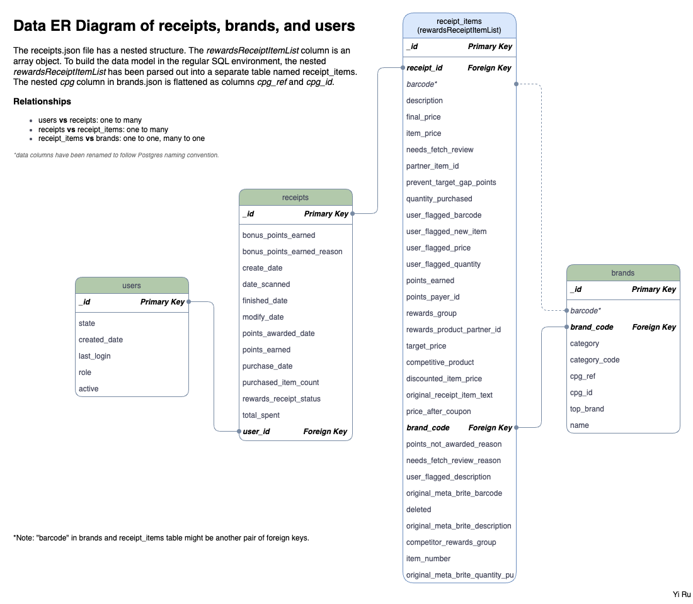

## Fetch Rewards Coding Exercise

Yi Ru

#### Question 1

I opened the JSON files and quickly examined the files - the original JSON files are seemingly in MongoDB JSON export format - it has a `"$oid"` structure in the id field, and all the objects are not constructed in an array (missing opening and ending `[]` and comma between objects). 

I reformatted the file to standard JSON format (an array of objects), then I noticed that the `receipts.json` file has a nested structure in the column `rewardsReceiptItemList`. Therefore, I created a Python script to flatten out the nested structure and upload the data to my local Postgres database for data modeling, located in `scripts/upload_json.py`.

The relational data model ER diagram is shown below:

---

#### Question 2

- **What are the top 5 brands by receipts scanned for most recent month?**

using interval get most recent month in receipt -> get most frequent barcode -> join brands table to get names

- **How does the ranking of the top 5 brands by receipts scanned for the recent month compare to the ranking for the previous month?**

interval - 1 month

- **When considering average spend from receipts with 'rewardsReceiptStatus’ of ‘Accepted’ or ‘Rejected’, which is greater?**

average(spend) where status = accepted, union average(spend) where status = rejected

- **When considering total number of items purchased from receipts with 'rewardsReceiptStatus’ of ‘Accepted’ or ‘Rejected’, which is greater?**

spend where status = accepted, union spend where status = rejected

- **Which brand has the most spend among users who were created within the past 6 months?**

users created within the past 6 months -> join receipts with most spend among -> join brands by barcode

- **Which brand has the most transactions among users who were created within the past 6 months?**

users last 6 months -> count(barcode) limit 1 -> join brands by barcode 